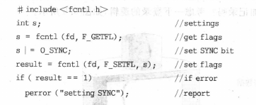
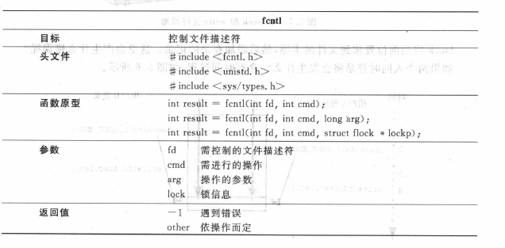
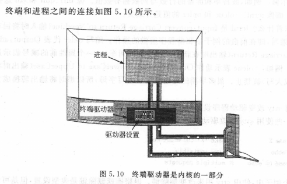
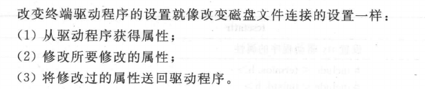
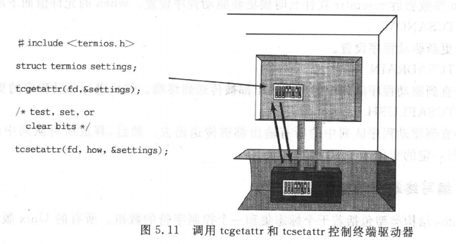
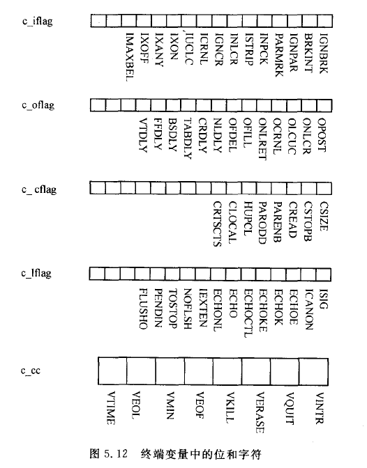

## 设备文件简述

通过 tty 查看

```
husharp@hjh-Ubuntu:~/CS/Unix-Linux$ tty
/dev/pts/1
```


```shell
husharp@hjh-Ubuntu:~/CS/Unix-Linux/test_a$ cat a
Today is Tues
husharp@hjh-Ubuntu:~/CS/Unix-Linux/test_a$ cp a /dev/pts/1
Today is Tues

```


ls 查看属性发现，前面 c 表示此文件是以字符为单位进行传送的设备

```shell
husharp@hjh-Ubuntu:~$ ls -li /dev/pts/1
4 crw--w---- 1 husharp tty 136, 1 12月  1 08:02 /dev/pts/1
```

由于设备文件的 inode 节点存储的是指向内核子程序的指针，而非普通文件的 inode 所包含的文件大小和存储列表。内核中传输设备数据的子程序被称为设备驱动子程序。

因此，上面的属性表示： 136 指的是设备-进程表中编号为 136 的子程序，该子程序接收一个参数，此处为 2 。

136 和 2 分别称为设备的主设备号和从设备号。


## write

在即时信息和聊天室出来之前，Unix 用户通过 write 来聊天

```shell
WRITE(1)                  BSD General Commands Manual                 WRITE(1)

NAME
     write — send a message to another user

SYNOPSIS
     write user [tty]

DESCRIPTION
     The write utility allows you to communicate with other users, by copying
     lines from your terminal to theirs.

```


## 磁盘连接属性

### 1、缓冲

修改实则为三步：

- 获取设置（系统调用获取
- 修改设置
- 存储设置



文件描述符的属性被编码在一个整数的位中。系统调用 fcntl 通过读写该整数位来控制 文件描述符 fd




O_SYNC 为缓冲


### 2、自动添加模式

将 O_APPEND 位置位，内核从而将 lseek 与 write 组合为原子操作


## 终端连接属性

终端驱动程序是内核的一部分



处理进程和外部设备间数据流的内核子程序的集合被称为终端驱动程序 或 tty 驱动程序。驱动程序包含很多控制设备操作的设置。进程可以通过  stty  来读取修改驱动程序的设置。

> tty 名字由来是值 Teletype 公司生产的老式打印终端



通常过程如下图所示




termios.h

```c
/* Put the state of FD into *TERMIOS_P.  */
extern int tcgetattr (int __fd, struct termios *__termios_p) __THROW;

/* Set the state of FD to *TERMIOS_P.
   Values for OPTIONAL_ACTIONS (TCSA*) are in <bits/termios.h>.  */
extern int tcsetattr (int __fd, int __optional_actions,
		      const struct termios *__termios_p) __THROW;
```

操作分为四种：

1. input
2. output
3. control ：字符如何表示？位的个数、位的奇偶性...
4. local ：本地处理：驱动程序处理来自驱动程序内部的字符，包括回显字符...



前四个为标志集，c_cc 是控制字符的数组，含有特殊功能的键都存储在这个数组中

```c
struct termios
  {
    tcflag_t c_iflag;		/* input mode flags */
    tcflag_t c_oflag;		/* output mode flags */
    tcflag_t c_cflag;		/* control mode flags */
    tcflag_t c_lflag;		/* local mode flags */
    cc_t c_line;			/* line discipline */
    cc_t c_cc[NCCS];		/* control characters */
    speed_t c_ispeed;		/* input speed */
    speed_t c_ospeed;		/* output speed */
#define _HAVE_STRUCT_TERMIOS_C_ISPEED 1
#define _HAVE_STRUCT_TERMIOS_C_OSPEED 1
  };
```

通过 & |  &~  进行置位


```shell
husharp@hjh-Ubuntu:~/CS/Unix-Linux/Unix&Linux_Programming/ch05$ ./setecho y
open sucess!
husharp@hjh-Ubuntu:~/CS/Unix-Linux/Unix&Linux_Programming/ch05$ ./echostate 
 echo is on , since its bit is 1
husharp@hjh-Ubuntu:~/CS/Unix-Linux/Unix&Linux_Programming/ch05$ ./setecho n
close sucess!
husharp@hjh-Ubuntu:~/CS/Unix-Linux/Unix&Linux_Programming/ch05$ ./echostate 
 echo if OFF, since its bit is 0
```


我们发现，当文件描述符指向设备驱动程序时，设备驱动程序具有属性设置，设备驱动程序通过属性设置来提供对设备驱动程序的控制。


