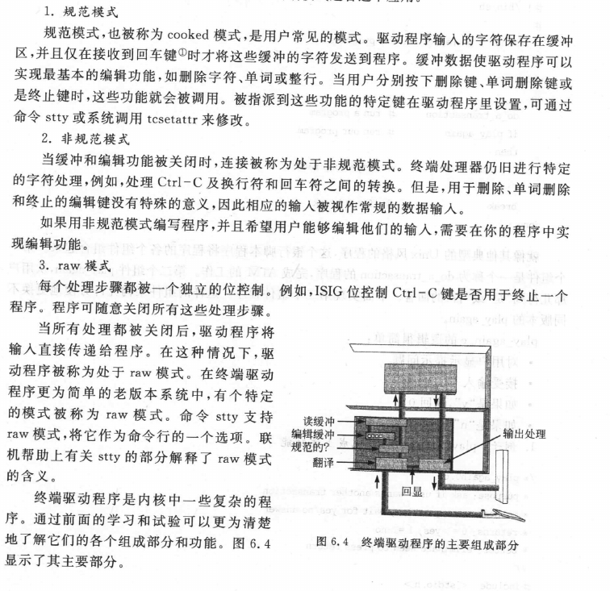
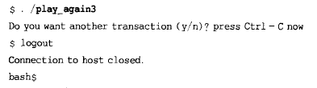
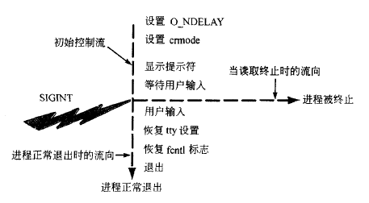
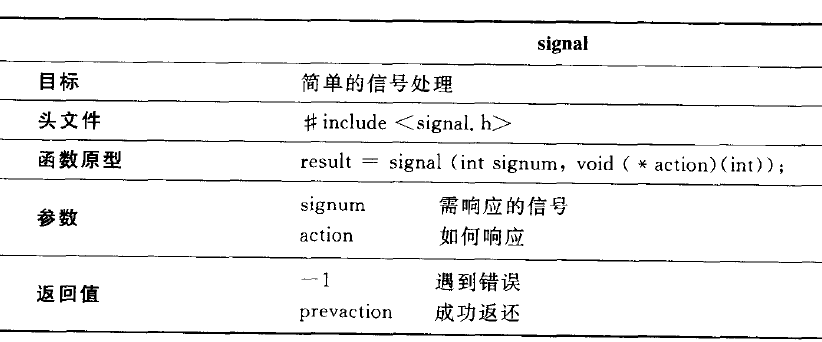

**ctype.h**是[C标准函数库](https://baike.baidu.com/item/C标准函数库)中的[头文件](https://baike.baidu.com/item/头文件)，定义了一批[C语言](https://baike.baidu.com/item/C语言)字符分类函数（C character classification functions），用于测试字符是否属于特定的字符类别，如字母字符、控制字符等等。既支持单字节字符，也支持[宽字符](https://baike.baidu.com/item/宽字符)。


## 为用户编程：终端控制和信号

一个简易的 demo 来展示设备驱动程序的细节

```c
#include   <stdio.h>
#include   <ctype.h>

int main()
{
    int c;
    while ( ( c=getchar() ) != EOF ){
        if ( c == 'z' )  
            c = 'a';
        else if (islower(c))
            c++;
        putchar(c);
    }
}
```


### 规范模式：缓存和编辑

**stty icanon 进行打开规范模式**

下面 stabstab^?^?^C 指的是 退格键不能被识别

这是由于非规范化没有缓冲，输入字符直接传到程序 rotate 中，然后 程序直接显示字符 ，当用户试图删除时，驱动程序无法做任何事：因为字符已经传给程序了。

并且不用回车直接显示输入字符处理后的结果 eg stststst

```shell
husharp@hjh-Ubuntu:~/CS/Unix-Linux/Unix&Linux_Programming/ch06$ stty -icanon
husharp@hjh-Ubuntu:~/CS/Unix-Linux/Unix&Linux_Programming/ch06$ ./rotate 
stabstab^?^?^Cststwx
husharp@hjh-Ubuntu:~/CS/Unix-Linux/Unix&Linux_Programming/ch06$ stty icanon
husharp@hjh-Ubuntu:~/CS/Unix-Linux/Unix&Linux_Programming/ch06$ ./rotate 
sasas  
```


**stty echo 打开回显**

### 终端模式小结




## 编写一个用户程序 playagain.c


### 1、playagain0 基本功能


```c
int get_response(char* question) {
    printf("%s (y/n)?", question);
    while(1) {
        switch(getchar()) {
            case 'y':
            case 'Y':
                return 0;
            case 'n':
            case 'N':
            case EOF:
                return 1;
            
        }
    }
}
```

现在问题在于：

用户必须按回车，playagain0 才能接收到数据。

因此现在需要对规范输入进行关闭，让用户敲键的同时，程序也能读取。直接将输入传递给程序


### 2、playagain1 关闭规范输入

因此此时对 mode 进行设置

```c
/* 
 * purpose: put file descriptor 0 (i.e. stdin) into chr-by-chr mode
 *  method: use bits in termios
 */
int set_crmode(){
    struct termios ttystate;

    tcgetattr(0, &ttystate);// read cur
    ttystate.c_lflag &= ~ICANON;/* no buffering		*/
    // VMIN定义了要求等待的最小字节数，
    // 下面表示将这个字节数 置为 1。
    ttystate.c_cc[VMIN] = 1;/* get 1 char at a time	*/
    tcsetattr(0, TCSANOW, &ttystate);
}
```

此时 output 如下：

```shell
husharp@hjh-Ubuntu:~/CS/Unix-Linux/Unix&Linux_Programming/ch06$ ./play_again1
Do you want another transaction (y/n)?s
cannot understand s, Please type y or no
a
cannot understand a, Please type y or no
s
cannot understand s, Please type y or no
d
cannot understand d, Please type y or no
f
cannot understand f, Please type y or no
g
cannot understand g, Please type y or no
y
response is 0
```

我们发现对于无效的输入，会显示错误提示，可能会让人烦，因此可以关闭回显模式，丢掉不需要的字符。


### 3、playagain2 关闭回显

现在对所有输入都关闭回显

```c
/* 
 * purpose: put file descriptor 0 into chr-by-chr mode and noecho mode
 *  method: use bits in termios
 */
int set_cr_noecho_mode(){
    struct termios ttystate;

    tcgetattr(0, &ttystate);// read cur
    ttystate.c_lflag &= ~ICANON;/* no buffering		*/
    ttystate.c_lflag &= ~ECHO;  // no echo
    // VMIN定义了要求等待的最小字节数，
    // 下面表示将这个字节数 置为 1。
    ttystate.c_cc[VMIN] = 1;/* get 1 char at a time	*/
    tcsetattr(0, TCSANOW, &ttystate);
}
```

那么此时不管输入啥，都是不显示输入字符

```shell
Do you want another transaction (y/n)?
response is 0
```

现在存在问题是：当用户输入完成，离开之后，后面来的人可以直接输入 y 进入上一个人的账号

也因此需要整一个超时判断，判断超时便关闭


### 4、playagain3  超时判断

超时判断思路：

先检查是否有输入，如果没有，就先休眠几秒钟，然后继续检查输入，如此尝试 3 次后进行关闭。


增加文件的某个flags，比如文件是阻塞的，想设置成非阻塞:

```c
     flags = fcntl(fd,F_GETFL,0);
	flags |= O_NONBLOCK;
	fcntl(fd,F_SETFL,flags);
```

>  fcntl.h，是unix标准中通用的头文件，其中包含的相关函数有 open，fcntl，shutdown，unlink，fclose等
>
> fcntl函数可以改变已打开文件的性质。函数原型如下：
>
> ```cpp
> #include <fcntl.h>
> 
> int fcntl(int filedes, int cmd, ...);
> ```
>
> 当第二个参数***cmd=F_GETFL***时，它的作用是取得文件描述符 filedes 的文件状态标志。
>
> 当第二个参数***cmd=F_SETFL***时，它的作用是设置文件描述符 filedes 的文件状态标志，这时第三个参数为新的状态标志。

采用 fcntl 对非阻塞打开，并采用 sleep 函数和 计数器 maxTries 进行尝试。 


代码如下：

首先保存最开始的 状态 和  文件描述符 stdin 的文件状态标志 flags

```c
int tty_mode(int how) {
    static struct termios original_mode;// 保存原状态
    static int original_flags;  // 保存 flags
    if(how == 0) {
        tcgetattr(0, &original_mode);
        original_flags = fcntl(0, F_GETFL);
    } else {
        return tcsetattr(0, TCSANOW, &original_mode);
        fcntl(0, F_SETFL, original_flags);
    }
}
```

#### 将此处设为非阻塞

对于无效字符，直接跳过（遇到无效字符时会阻塞，但是开启非阻塞状态后，直接会返回）。

```c
/*
 * purpose: put file descriptor 0 into no-delay mode
 *  method: use fcntl to set bits
 *   notes: tcsetattr() will do something similar, but it is complicated
 */
int set_nodelay_mode() {
    int flags;
    flags = fcntl(0, F_GETFL);// get
    flags |= O_NDELAY;// 非阻塞
    fcntl(0, F_SETFL, flags);// set
}
```

> 1. 阻塞(block)概念:指进程或线程在执行设备操作或管道，或则网络时，不能获取到资源就被挂起，
>     直到满足可操作的条件后在进行操作，被挂起的进程进入休眠状态，从运行队列移走，直到
>     等待的条件满足才继续执行。也就是执行到某些函数时必须等待某个事件发生函数才返回。
> 2. 非阻塞(non_block):进程就算没有获取到资源或没有等到事件发生时不挂起，通常会直接放弃或不断查询，
>     直到可以进行的位置。也就是函数的执行不必等待事件发生，一旦执行肯定返回，用返回值来反应函数执行情况。

并设置一个计时器，当在规定时间内没有合法输入的情况下，会自动退出。


对于不匹配的字符进行跳过（开启非阻塞）

```c
/*
 * purpose: ask a question and wait for a y/n answer or maxtries
 *  method: use getchar and complain about non-y/n input
 * returns: 0=>yes, 1=>no, 2=>timeout
 */
int get_response(char* question, int maxTries) {
    printf("%s (y/n)?", question);
    int input;
    while(1) {
        sleep(SLEEPTIME);
        input = tolower(get_ok_char());
        if ( input == 'y' )
			return 0;
		if ( input == 'n' )
			return 1;
		if ( maxTries-- == 0 )			/* outatime?	*/
			return 2;			/* sayso	*/
        BEEP;// 提示
    }
}

/*
 *  skip over non-legal chars and return y,Y,n,N or EOF
 */
int get_ok_char() {
    int c;
    // strchr 查找第一个匹配处
    // 对于不匹配的循环
    while( (c = getchar()) != EOF && strchr("yYnN", c) == NULL);
    return c;
}
```


### 5、遗留问题

当 playagain3 想要输入 Ctrl+C 提前终止时，会发生什么呢？



发现不但终止了程序 playagain3，更是对整个登录会话都进行了终结。

这是为啥？分析如下

先看一下总过程



首先是保存终端之前状态（阻塞、回显..)，然后初始化控制流，将此时终端设为非阻塞，并且进入主循环打印提示，然后按下 Ctrl+C 来终止程序。

值得注意！！！此时的终端还处于非阻塞态，并未恢复！

因此！当终止程序后，便回到 shell， shell 会调用 read 继续开始自己的日常工作读取命令行，但是！此时并没有输入！且又处于非阻塞态，因此 read 会立即返回一个 0，表示此时错误。因此 shell 会被 init 进程杀死。  


## 信号

例如出现线上系统故障，这个时候，什么流程都来不及了，不可能发邮件，也来不及开会，所有的架构师、开发、运维都要被通知紧急出动。所以，7 乘 24 小时不间断执行的系统都需要有告警系统，一旦出事情，就要通知到人，哪怕是半夜，也要电话叫起来，处理故障。

对应到操作系统中，就是信号。信号没有特别复杂的数据结构，就是用一个代号一样的数字。Linux 提供了几十种信号，分别代表不同的意义。信号之间依靠它们的值来区分。这就像咱们看警匪片，对于紧急的行动，都是说，“1  号作战任务”开始执行，警察就开始行动了。情况紧急，不能啰里啰嗦了。

信号可以在任何时候发送给某一进程，进程需要为这个信号配置信号处理函数。当某个信号发生的时候，就默认执行这个函数就可以了。这就相当于咱们运维一个系统应急手册，当遇到什么情况，做什么事情，都事先准备好，出了事情照着做就可以了。


首先，第一件要做的事情就是，整个团队要想一下，线上到底能够产生哪些异常情况，越全越好。于是，我们就有了上面这个很长很长的列表。

在 Linux 操作系统中，为了响应各种各样的事件，也是定义了非常多的信号。我们可以通过 kill -l 命令，查看所有的信号。

```shell
husharp@hjh-Ubuntu:~$ kill -l
 1) SIGHUP	 2) SIGINT	 3) SIGQUIT	 4) SIGILL	 5) SIGTRAP
 6) SIGABRT	 7) SIGBUS	 8) SIGFPE	 9) SIGKILL	10) SIGUSR1
11) SIGSEGV	12) SIGUSR2	13) SIGPIPE	14) SIGALRM	15) SIGTERM
16) SIGSTKFLT	17) SIGCHLD	18) SIGCONT	19) SIGSTOP	20) SIGTSTP
21) SIGTTIN	22) SIGTTOU	23) SIGURG	24) SIGXCPU	25) SIGXFSZ
26) SIGVTALRM	27) SIGPROF	28) SIGWINCH	29) SIGIO	30) SIGPWR
31) SIGSYS	34) SIGRTMIN	35) SIGRTMIN+1	36) SIGRTMIN+2	37) SIGRTMIN+3
38) SIGRTMIN+4	39) SIGRTMIN+5	40) SIGRTMIN+6	41) SIGRTMIN+7	42) SIGRTMIN+8
43) SIGRTMIN+9	44) SIGRTMIN+10	45) SIGRTMIN+11	46) SIGRTMIN+12	47) SIGRTMIN+13
48) SIGRTMIN+14	49) SIGRTMIN+15	50) SIGRTMAX-14	51) SIGRTMAX-13	52) SIGRTMAX-12
53) SIGRTMAX-11	54) SIGRTMAX-10	55) SIGRTMAX-9	56) SIGRTMAX-8	57) SIGRTMAX-7
58) SIGRTMAX-6	59) SIGRTMAX-5	60) SIGRTMAX-4	61) SIGRTMAX-3	62) SIGRTMAX-2
63) SIGRTMAX-1	64) SIGRTMAX	
```

通过查看 man 7 signal

```shell
	  Signal     Value     Action   Comment
	  --------------------------------------------------------------------------------
      SIGHUP        1       Term    Hangup detected on controlling terminal  or death of controlling process
       SIGINT        2       Term    Interrupt from keyboard
       SIGQUIT       3       Core    Quit from keyboard
       SIGILL        4       Core    Illegal Instruction
       SIGABRT       6       Core    Abort signal from abort(3)
       SIGFPE        8       Core    Floating-point exception
       SIGKILL       9       Term    Kill signal
       SIGSEGV      11       Core    Invalid memory reference
       SIGPIPE      13       Term    Broken pipe: write to pipe with no
                                     readers; see pipe(7)
       SIGALRM      14       Term    Timer signal from alarm(2)
       SIGTERM      15       Term    Termination signal
       SIGUSR1   30,10,16    Term    User-defined signal 1
       SIGUSR2   31,12,17    Term    User-defined signal 2
```

发现：中断信号被称为 SIGINT、退出信号被称为 SIGQUIT


一旦有信号产生，我们就有下面这几种，用户进程对信号的处理方式。进程能够通过系统调用 signal 告诉内核，它要如何处理信号。

1.**执行默认操作**。Linux 对每种信号都规定了默认操作，例如，上面列表中的 Term，就是终止进程的意思。Core 的意思是 Core Dump，也即终止进程后，通过 Core Dump 将当前进程的运行状态保存在文件里面，方便程序员事后进行分析问题在哪里。（dump ——备份）

2.**捕捉信号**。我们可以为信号定义一个信号处理函数。当信号发生时，我们就执行相应的信号处理函数。

3.**忽略信号**。当我们不希望处理某些信号的时候，就可以忽略该信号，不做任何处理。有两个信号是应用进程无法捕捉和忽略的，即 SIGKILL 和 SEGSTOP，它们用于在任何时候中断或结束某一进程。


这其实就是定义一个方法，并且将这个方法和某个信号关联起来。当这个进程遇到这个信号的时候，就执行这个方法。

以 SIGINT 为例：

- **执行默认操作**：signal(SIGINT, SIG_DFL) 恢复默认处理
- **捕捉信号**：signal(signum, funcName) , funcName为信号到来时被调用的函数
- **忽略信号**：signal(SIGINT, SIG_IGN)  



#### 1、**捕捉信号demo**

```c
int main() {
    int i;
    signal(SIGINT, f);// 
    for (i = 0; i < 5; i++)
    {
        printf("hello\n");
        sleep(1);
    }
    
}

void f(int signum) {
    printf("O!\n");
}

// output
hello
hello  
^CO! <- Ctrl+C
hello
^CO! <- Ctrl+C
hello
^CO! <- Ctrl+C
hello
```

2、**忽略信号demo**

```c
int main() {
    signal(SIGINT, SIG_IGN);// 忽略信号 
    printf("you can't stop me!\n");
    printf("try Ctrl+C?\n");

    while(1) {
        sleep(1);
        // 在UNIX类系统，换行\n就表现为光标下一行并回到行首
        printf("hahha(´∀`)σ)Д`)\n");
    }  
}
// output
you can't stop me!
try Ctrl+C?
hahha(´∀`)σ)Д`)
hahha(´∀`)σ)Д`)
hahha(´∀`)σ)Д`)
^Chahha(´∀`)σ)Д`)
^Chahha(´∀`)σ)Д`)
^Chahha(´∀`)σ)Д`)
^\退出 (核心已转储)
```

1、首先值得注意的是：

`printf("hahha(´∀`)σ)Д`)\n");`必须加上 \n 才能从缓冲区中读取！

printf()，是先将格式化好的信息先输到缓冲区上，因为输入输出的缓存为行缓存，所以当填满I/O缓存后，才进行实际I/O操作或者遇到换行符‘\n’（或者执行fflush、floce、exit、return），缓存大小为1K。

譬如去掉 \n ，加上 fflush 后，行缓存便被刷新：

```shell
you can't stop me!
try Ctrl+C?
hahha(´∀`)σ)Д`)hahha(´∀`)σ)Д`)hahha(´∀`)σ)Д`)hahha(´∀`)σ)Д`)^Chahha(´∀`)σ)Д`)hahha(´∀`)σ)Д`)^\退出 (核心已转储)
```

2、其次

此处是对 Ctrl + C 进行忽略中断信号，当按键 Ctrl + \ 时，发送 quit 信号，这个程序没有忽略或捕捉此信号，因此可以退出。


### 6、遗留问题解决

此时接回之前遗留的问题，对应 Ctrl + C 采用捕获信号，使用特定函数即可

```c
void ctrl_c_handler(int signum) {
    tty_mode(1);// 恢复
    exit(2);
}
```

现在便知道可以对 Ctrl+C 先恢复之前状态，再退出，而不是之前的一下退出。

并对 tty_mode 进行判断。对于改变了状态进行标记。

```c
int tty_mode(int how) {
    static struct termios original_mode;// 保存原状态
    static int original_flags;  // 保存
    static int changed = 0;// 表示之前是否改变

    if(how == 0) {
        tcgetattr(0, &original_mode);
        original_flags = fcntl(0, F_GETFL);
        changed = 1;// 表示 change
    } else if(changed) {// 进行恢复
        return tcsetattr(0, TCSANOW, &original_mode);
        fcntl(0, F_SETFL, original_flags);
    }
}
```

至此便能直接退出了。


# 进程间通信

## 管道模型


管道分为两种类型：匿名管道、命名管道

“|” 表示的管道称为**匿名管道**，意思就是这个类型的管道没有名字，用完了就销毁了。就像上面那个命令里面的一样，竖线代表的管道随着命令的执行自动创建、自动销毁。用户甚至都不知道自己在用管道这种技术，就已经解决了问题。所以这也是面试题里面经常会问的，到时候千万别说这是竖线，而要回答背后的机制，管道。

另外一种类型是**命名管道**。这个类型的管道需要通过 mkfifo 命令显式地创建。

```shell
mkfifo hello
```

hello 就是这个管道的名称。管道以文件的形式存在，这也符合 Linux 里面一切皆文件的原则。这个时候，我们 ls 一下，可以看到，这个文件的类型是 p，就是 pipe 的意思。

```
prw-r--r-- 1 husharp husharp   0 12月  1 18:07 hello
```

我们可以往管道里面写入东西。例如，写入一个字符串。

```


```


