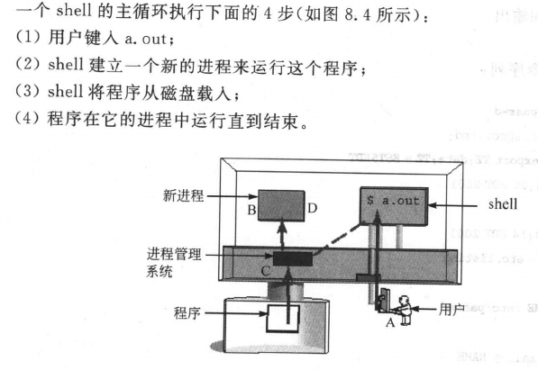
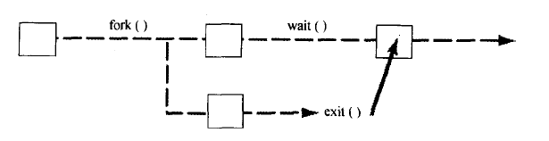
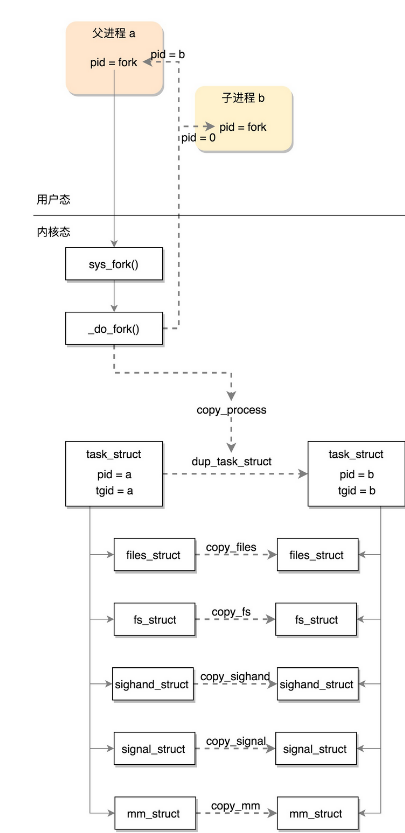
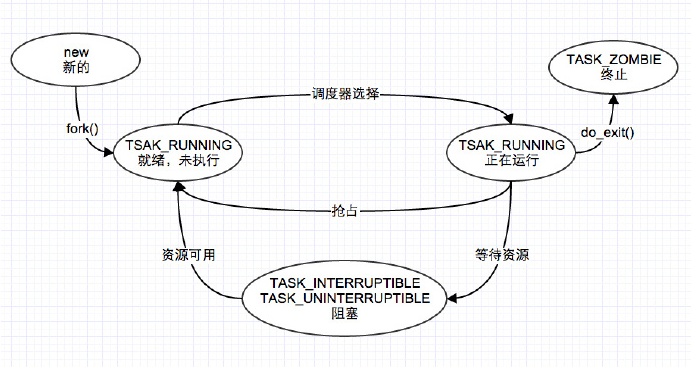
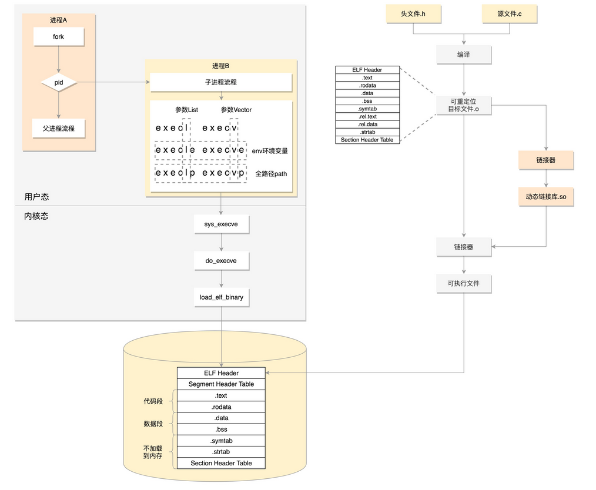
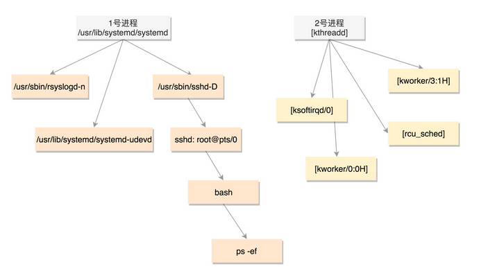

头文件

unistd.h：sleep、getpid

stdlib.h：exit

<sys/wait.h>：wait

## shell 是如何运行程序的

### 1、shell 的功能

- 运行程序
- 管理输入输出
- 可编程


### 2、shell 由下面主循环构成




fork execvp 详见这篇 Blog

如何创立进程：fork

如何运行一个程序：execpv

还需要知道如何让父进程等待子进程



系统调用 wait 做两件事

- wait 暂停调用它的进程直至子进程结束
- wait 取得子进程结束时传给 exit 的值


## 用系统调用创建进程

[Linux下进程的创建过程分析](https://blog.csdn.net/gatieme/article/details/51569932#t12)

[Linux程序加载过程](https://blog.csdn.net/hnzziafyz/article/details/52200265)

1）在shell界面输入 **./可执行文件名**

​       经shell分析，该参数非shell内建命令，则认为是加载可执行文件。于是调用fork函数开始创建新进程，产生 0x80 中断，映射到函数 sys_fork()中，调用 find_empty_process()函数，为新进程申请一个可用的进程号。

2）为可执行程序的管理结构找到存储空间

​      为了实现对进程的保护，系统为每个进程的管理专门设计了一个结构，即 task_struct。内核通过调用 get_free_page 函数获得用于保存 task_struct 和 内核栈 的页面只能在内核的线性地址空间。

3）shell进程为新进程复制 task_struct 结构

​       为可执行程序复制了 task_struct 后，新进程便继承了shell的全部管理信息。但由于每个进程呢的task_struct结构中的信息是不一样的，所以还要对该结构进行个性化设置（为防止在设置的过程中被切换到该进程，应先设置为不可中断状态）。个性化设置主要包括进程号、父进程、时间片、TSS段（为进程间切换而设计的，进程的切换时建立在对进程的保护的基础上的，在进程切换时TSS用来保存或恢复该进程的现场所用到的寄存器的值）。这些都是通过函数copy_process来完成的。

4）复制新进程页表并设置其对应的页目录项

​      现在调用函数 copy_mem为进程分段（LDT），更新代码段和数据段的基地址，即确定线性地址空间（关键在于确定段基址和限长）。接着就是分页，分页是建立在分段的基础上的。

5）将新进程设置为就绪状态

6）加载可执行文件

​     进入 do_execve 函数之后，将可执行文件的头表加载到内存中并检测相关信息。加载执行程序（讲程序按需加载到内存）。



do_exit()完成线程退出的任务，其主要功能是将线程占用的系统资源释放，do_exit()的基本流程如下： 

将进程内存管理相关的资源释放

1. 将进程ICP semaphore相关资源释放
2. __exit_files()、__exit_fs()。将进程文件管理相关的资源释放。
3. exit_thread()。只要目的是释放平台相关的一些资源。
4. exit_notify()。在Linux中进程退出时要将其退出的原因告诉父进程，父进程调用wait()系统调用后会在一个等待队列上睡眠。
5. schedule()。调用进程调度器，因为此进程已经退出，切换到其他进程。

**进程的创建到执行过程如下图所示**




## 总结创建过程

首先通过图右边的文件编译过程，生成 so 文件和可执行文件，放在硬盘上。下图左边的用户态的进程 A 执行 fork，创建进程 B，在进程 B  的处理逻辑中，执行 exec 系列系统调用。这个系统调用会通过 load_elf_binary 方法，将刚才生成的可执行文件，加载到进程 B  的内存中执行。




## 附：进程树

既然所有的进程都是从父进程 fork 过来的，那总归有一个祖宗进程，这就是咱们系统启动的 init 进程。



PID 1 的进程就是我们的 init 进程 systemd，PID 2 的进程是内核线程 kthreadd，这两个我们在内核启动的时候都见过。其中用户态的不带中括号，内核态的带中括号。

接下来进程号依次增大，但是你会看所有带中括号的内核态的进程，祖先都是 2 号进程。而用户态的进程，祖先都是 1 号进程。tty 那一列，是问号的，说明不是前台启动的，一般都是后台的服务。

```
UID        PID  PPID  C STIME TTY          TIME CMD
root         1     0  0 18:59 ?        00:00:13 /sbin/init splash
root         2     0  0 18:59 ?        00:00:00 [kthreadd]
root         3     2  0 18:59 ?        00:00:00 [rcu_gp]
root         4     2  0 18:59 ?        00:00:00 [rcu_par_gp]
root         6     2  0 18:59 ?        00:00:00 [kworker/0:0H-kb]
root         7     2  0 18:59 ?        00:00:00 [kworker/0:1-eve]
systemd+   702     1  0 18:59 ?        00:00:01 /lib/systemd/systemd-resolved
systemd+   704     1  0 18:59 ?        00:00:00 /lib/systemd/systemd-timesyncd
root       848     1  0 18:59 ?        00:00:00 /usr/sbin/cron -f
avahi      850     1  0 18:59 ?        00:00:00 avahi-daemon: running [hjh-Ubunt
root       852     1  0 18:59 ?        00:00:00 /usr/sbin/cupsd -l
root       857     1  0 18:59 ?        00:00:00 /usr/sbin/acpid
```


