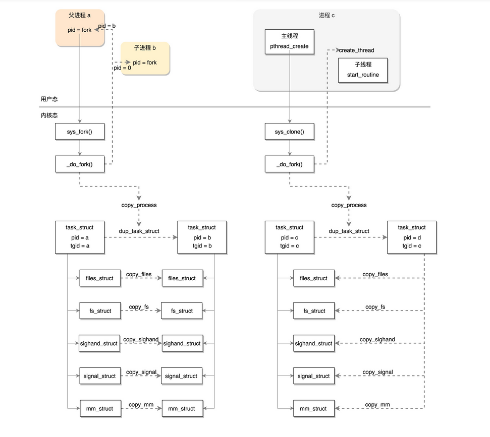
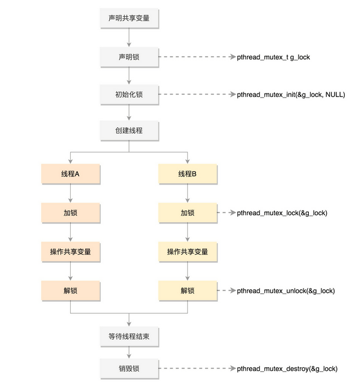
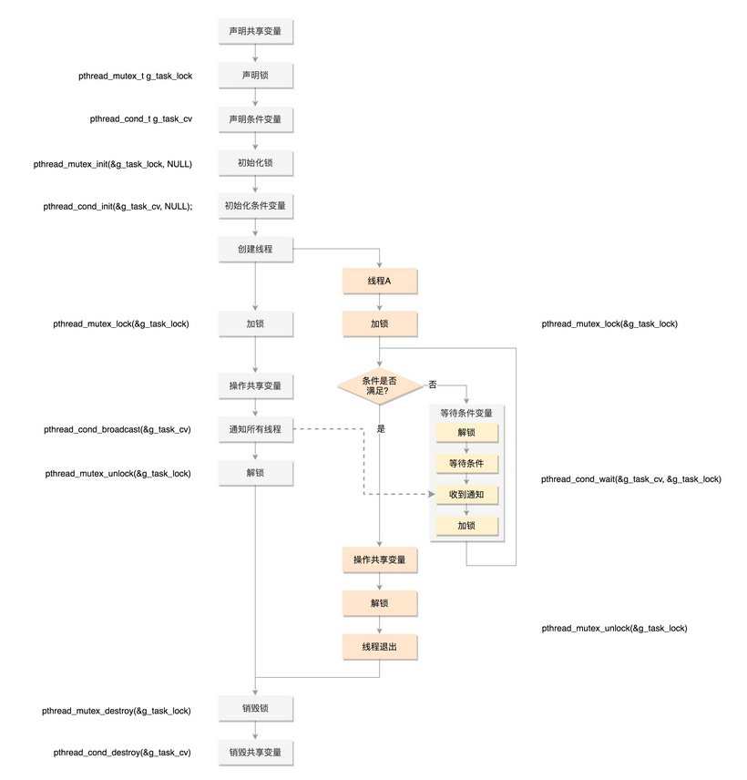
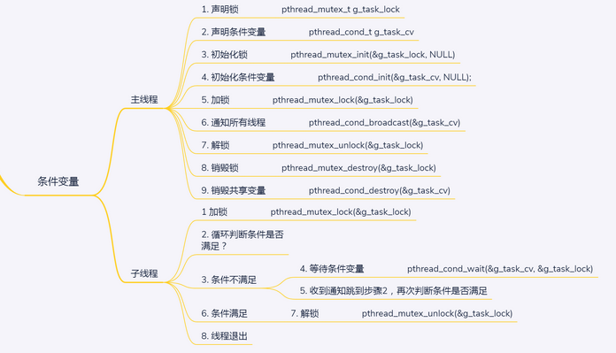

[POSIX介绍](https://blog.csdn.net/weixin_40039738/article/details/81867577)

线程接口也称为“pthread”或“POSIX 线程"

使用 pthread 需要包含一个头文件：pthread.h

 同时连一个共享库：libpthread.so  即 gcc 编译时加选项 -lpthread**

```shell
gcc twoCount3.c -lpthread -o twc
```

# "用户线程"的创建

[Linux下调用pthread库创建的线程是属于用户级线程还是内核级线程](https://www.zhihu.com/question/35128513)

用户调用pthread库创建的一个线程，会在内核创建一个“线程”，这就是所谓的1：1模型。

Linux里，用户代码通过pthread库创建线程的过程虽然看似是用户在创建“用户级线程”，实际上是pthread_create暗中调用了clone系统调用，由操作系统帮忙创建内核级线程的过程，因而不能称作用户级线程。


## 线程的创建：如何执行一个新子项目？


## 用户态创建线程

你可能会问，咱们之前不是讲过了吗？无论是进程还是线程，在内核里面都是任务，管起来不是都一样吗？但是问题来了，如果两个完全一样，那为什么咱们创建线程进程写的程序差别那么大？如果不一样，那怎么在内核里面加以区分呢？

其实，线程不是一个完全由内核实现的机制，它是由内核态和用户态合作完成的。pthread_create 不是一个系统调用，是 Glibc 库的一个函数，所以我们还要去 Glibc 里面去找线索。


> **pthread_create** 
>
> pthread_create 不是一个系统调用，是 Glibc 库的一个函数
>
> 对于每一个文件和每一个线程，可以调用 pthread_create 创建线程。一共有四个参数，第一个参数是线程对象，第二个参数是线程的属性，第三个参数是线程运行函数，第四个参数是线程运行函数的参数。主线程就是通过第四个参数，将自己的任务派给子线程。

> **pthread_join**
>
> 
>
> 当一个线程退出的时候，就会发送信号给其他所有同进程的线程。有一个线程使用 pthread_join 获取这个线程退出的返回值。线程的返回值通过 pthread_join 传给主线程，这样子线程就将自己返回值信息告诉给主线程。

### 步骤

首先处理的是线程的属性参数

接下来，就像在内核里一样，每一个进程或者线程都有一个 task_struct 结构，在用户态也有一个用于维护线程的结构，就是这个 pthread 结构。

凡是涉及函数的调用，都要使用到栈。每个线程也有自己的栈。那接下来就是创建线程栈了。


> 线程栈的创建
>
> allocate_stack 主要做了以下这些事情：
>
> - 如果你在线程属性里面设置过栈的大小，需要你把设置的值拿出来；
> - 为了防止栈的访问越界，在栈的末尾会有一块空间 guardsize，一旦访问到这里就错误了；
> - 其实**线程栈是在进程的堆里面创建的**。如果一个进程不断地创建和删除线程，我们不可能不断地去申请和清除线程栈使用的内存块，这样就需要有一个缓存。get_cached_stack 就是根据计算出来的 size 大小，看一看已经有的缓存中，有没有已经能够满足条件的；
> - 如果缓存里面没有，就需要调用  __ mmap 创建一块新的，系统调用那一节我们讲过，如果要在堆里面 malloc 一块内存，比较大的话，用 __mmap；
> - 线程栈也是自顶向下生长的，还记得每个线程要有一个 pthread 结构，这个结构也是放在栈的空间里面的。在栈底的位置，其实是地址最高位；
> - 计算出 guard 内存的位置，调用 setup_stack_prot 设置这块内存的是受保护的；
> - 接下来，开始填充 pthread 这个结构里面的成员变量  stackblock、stackblock_size、guardsize、specific。这里的 specific 是用于存放 Thread  Specific Data 的，也即属于线程的全局变量；
> - 将这个线程栈放到 stack_used 链表中，其实管理线程栈总共有两个链表，一个是 stack_used，也就是这个栈正被使用；另一个是 stack_cache，就是上面说的，一旦线程结束，先缓存起来，不释放，等有其他的线程创建的时候，给其他的线程用。

pthread_create 函数：

```c
... 
pd->start_routine = start_routine;
pd->arg = arg;
pd->schedpolicy = self->schedpolicy;
pd->schedparam = self->schedparam;
/* Pass the descriptor to the caller.  */
*newthread = (pthread_t) pd;
atomic_increment (&__nptl_nthreads);
retval = create_thread (pd, iattr, &stopped_start, STACK_VARIABLES_ARGS, &thread_ran);
```

start_routine 就是咱们给线程的函数，start_routine，start_routine 的参数 arg，以及调度策略都要赋值给 pthread。

接下来 __nptl_nthreads 加一，说明有多了一个线程。

发现真正创建线程的是调用 create_thread 函数

create_thread -> 调用 __clone 函数，然后进入系统调用，调用  _do_fork 函数

```c
SYSCALL_DEFINE5(clone, unsigned long, clone_flags, unsigned long, newsp,
		 int __user *, parent_tidptr,
		 int __user *, child_tidptr,
		 unsigned long, tls)
{
	return _do_fork(clone_flags, newsp, 0, parent_tidptr, child_tidptr, tls);
}
```

1、然后就是一系列的环境复制

- 对于 copy_files，原来是调用 dup_fd 复制一个 files_struct 的，现在因为 CLONE_FILES 标识位变成将原来的 files_struct 引用计数加一。
- 对于 copy_fs，原来是调用 copy_fs_struct 复制一个 fs_struct，现在因为 CLONE_FS 标识位变成将原来的 fs_struct 的用户数加一。
- 对于 copy_sighand，原来是创建一个新的 sighand_struct，现在因为 CLONE_SIGHAND 标识位变成将原来的 sighand_struct 引用计数加一。
- 对于 copy_mm，原来是调用 dup_mm 复制一个 mm_struct，现在因为 CLONE_VM 标识位而直接**指向了原来的 mm_struct**

2、对于亲缘关系的影响

- 如果是新进程，那这个进程的 group_leader 就是他自己，tgid 是它自己的  pid，这就完全重打锣鼓另开张了，自己是线程组的头。如果是新线程，group_leader 是当前进程的，group_leader，tgid  是当前进程的 tgid，也就是当前进程的 pid，这个时候还是拜原来进程为老大。

3、对于信号的处理

如何保证发给进程的信号虽然可以被一个线程处理，但是影响范围应该是整个进程的。例如，kill 一个进程，则所有线程都要被干掉？

当发生信号时，如果这个 task_struct 是一个线程，这里面的信号就是发给这个线程的；如果这个 task_struct 是一个进程，这里面的信号是发给主线程的。

在创建进程的过程中，会初始化 signal_struct 里面的 struct sigpending shared_pending。

在创建线程的过程中，连 signal_struct 都共享了。也就是说，整个进程里的所有线程共享一个 shared_pending，这也是一个信号列表，是发给整个进程的，哪个线程处理都一样。


## 用户态执行线程

根据 __clone 的第一个参数，回到用户态也不是直接运行我们指定的那个函数，而是一个通用的 start_thread，这是所有线程在用户态的统一入口。

在 start_thread 入口函数中，才真正的调用用户提供的函数，在用户的函数执行完毕之后，会释放这个线程相关的数据。例如，线程本地数据  thread_local variables，线程数目也减一。如果这是最后一个线程了，就直接退出进程，另外 __free_tcb 用于释放  pthread。


## 线程进程创建对比




## Demo 实现

现在完成一个并行记录文件中单词个数多线程应用

对于线程需要多个参数， 可以采用结构体来传送

```c
struct arg_set{
    char *fname;
    int cnt;
};
```

进行线程的创建

```c
    args1.fname = argv[1];
    args1.cnt = 0;
    pthread_create(&t1, NULL, countWords, (void*)&args1);
    
    args2.fname = argv[2];
    args2.cnt = 0;
    pthread_create(&t2, NULL, countWords, (void*)&args2);
```

等待线程完成，并返回参数

```c
    // 进行等待
    pthread_join(t1, NULL);
    pthread_join(t2, NULL);

    printf("%5d: %s\n", args1.cnt, argv[1]);
	printf("%5d: %s\n", args2.cnt, argv[2]);
	printf("%5d: total words\n", args1.cnt + args2.cnt);
```

output

```shell
husharp@hjh-Ubuntu:~/CS/Unix-Linux/Unix&Linux_Programming/ch14$ ./twc ./README.md ./twoCount3.c 
    3: ./README.md
  168: ./twoCount3.c
  171: total words
```


# 内核线程的创建

[Linux内核线程kernel thread详解](https://blog.csdn.net/gatieme/article/details/51589205)

## 为什么需要内核线程

------

Linux内核可以看作一个服务进程(管理软硬件资源，响应用户进程的种种合理以及不合理的请求)。

内核需要多个执行流并行，为了防止可能的阻塞，支持多线程是必要的。

内核线程就是内核的分身，一个分身可以处理一件特定事情。内核线程的调度由内核负责，一个内核线程处于阻塞状态时不影响其他的内核线程，因为其是调度的基本单位。

这与用户线程是不一样的。因为内核线程只运行在内核态。

因此，它只能使用大于PAGE_OFFSET（传统的x86_32上是3G）的地址空间。


## 2 号进程kthreadd

linux-2.6.22引入了kthreadd进程, 并随后演变为2号进程, 它在系统初始化时同1号进程一起被创建(当然肯定是通过kernel_thread), [参见rest_init函数](http://lxr.linux.no/linux+v2.6.22/init/main.c#L426), 并随后演变为创建内核线程的真正建造师, [参见kthreadd](http://lxr.linux.no/linux+v2.6.22/+search=kthreadd)和[kthreadd函数](http://lxr.linux.no/linux+v2.6.22/kernel/kthread.c#L230), 它会循环的是查询工作链表[static LIST_HEAD(kthread_create_list);](http://lxr.linux.no/linux+v2.6.22/kernel/kthread.c#L19)中是否有需要被创建的内核线程, 而我们的通过kthread_create执行的操作, 只是在内核线程任务队列kthread_create_list中增加了一个create任务, 然后会唤醒kthreadd进程来执行真正的创建操作 


内核线程会出现在系统进程列表中, 但是在ps的输出中进程名command由方括号包围, 以便与普通进程区分。

如下所示, 我们可以看到系统中, 所有内核线程都用[]标识, 而且这些进程父进程id均是2, 而2号进程kthreadd的父进程是0号进程

```shell
UID        PID  PPID  C STIME TTY          TIME CMD
root         1     0  0 08:33 ?        00:00:26 /sbin/init splash
root         2     0  0 08:33 ?        00:00:00 [kthreadd]
root         3     2  0 08:33 ?        00:00:00 [rcu_gp]
root         4     2  0 08:33 ?        00:00:00 [rcu_par_gp]
root      1675     2  0 08:33 ?        00:02:04 [irq/148-nvidia]
root      1676     2  0 08:33 ?        00:00:00 [nvidia]
husharp   1948  1895  0 08:34 tty2     00:00:00 ibus-daemon --xim --panel disabl
husharp   1952  1948  0 08:34 tty2     00:00:00 /usr/lib/ibus/ibus-dconf
husharp   1954     1  0 08:34 tty2     00:00:00 /usr/lib/ibus/ibus-x11 --kill-da
husharp   1956  1654  0 08:34 ?        00:00:03 /usr/lib/ibus/ibus-portal
```

kernel_thread是最基础的创建内核线程的接口, 它通过将一个函数直接传递给内核来创建一个进程, 创建的进程运行在内核空间, 并且与其他进程线程共享内核虚拟地址空间

```c
pid_t kernel_thread(int (*fn)(void *), void *arg, unsigned long flags)
{
    return _do_fork(flags|CLONE_VM|CLONE_UNTRACED, (unsigned long)fn,
            (unsigned long)arg, NULL, NULL, 0);
}
```

创建内核更常用的方法是辅助函数kthread_create，该函数创建一个新的内核线程。最初线程是停止的，需要使用wake_up_process启动它。


# 线程的数据

我们把线程访问的数据细分成三类。下面我们一一来看


第一类是**线程栈上的本地数据**，比如函数执行过程中的局部变量。前面我们说过，函数的调用会使用栈的模型，这在线程里面是一样的。只不过每个线程都有自己的栈空间。

主线程在内存中有一个栈空间，其他线程栈也拥有独立的栈空间。为了避免线程之间的栈空间踩踏，线程栈之间还会有小块区域，用来隔离保护各自的栈空间。一旦另一个线程踏入到这个隔离区，就会引发段错误。

栈的大小可以通过命令 ulimit -a 查看，默认情况下线程栈大小为 8192（8MB）。我们可以使用命令 ulimit -s 修改。

对于线程栈，可以通过下面这个函数 pthread_attr_t，修改线程栈的大小。

```c
int pthread_attr_setstacksize(pthread_attr_t *attr, size_t stacksize);
```


第二类数据就是**在整个进程里共享的全局数据**。例如全局变量，虽然在不同进程中是隔离的，但是在一个进程中是共享的。如果同一个全局变量，两个线程一起修改，那肯定会有问题，有可能把数据改的面目全非。这就需要有一种机制来保护他们，比如你先用我再用。这一节的最后，我们专门来谈这个问题。

那线程能不能像进程一样，也有自己的私有数据呢？如果想声明一个线程级别，而非进程级别的全局变量，有没有什么办法呢？虽然咱们都是一个大组，分成小组，也应该有点隐私。


## 数据的保护

接下来，我们来看共享的数据保护问题。

### 1、信号量与互斥

> **区别**
>
> 互斥只能一个：
>
> 一个防止他人进入的简单方法，就是门口加一把锁。先到的人锁上门，后到的人看到上锁，就在门口排队，等锁打开再进去。这就叫["互斥锁"](http://zh.wikipedia.org/wiki/互斥锁)（Mutual exclusion，缩写 Mutex），防止多个线程同时读写某一块内存区域。
>
> 信号量可以多个：
>
> 就是在门口挂n把钥匙。进去的人就取一把钥匙，出来时再把钥匙挂回原处。后到的人发现钥匙架空了，就知道必须在门口排队等着了。这种做法叫做["信号量"](http://en.wikipedia.org/wiki/Semaphore_(programming))（Semaphore），用来保证多个线程不会互相冲突。
>
> mutex是semaphore的一种特殊情况（n=1时）。也就是说，完全可以用后者替代前者。但是，因为mutex较为简单，且效率高，所以在必须保证资源独占的情况下，还是采用这种设计。

我们先来看一种方式，**Mutex**，全称 Mutual Exclusion，中文叫**互斥**。顾名思义，有你没我，有我没你。它的模式就是在共享数据访问的时候，去申请加把锁，谁先拿到锁，谁就拿到了访问权限，其他人就只好在门外等着，等这个人访问结束，把锁打开，其他人再去争夺，还是遵循谁先拿到谁访问。



使用 Mutex，首先要使用 pthread_mutex_init 函数初始化这个 mutex，初始化后，就可以用它来保护共享变量了。

pthread_mutex_lock() 就是去抢那把锁的函数，如果抢到了，就可以执行下一行程序，对共享变量进行访；如果没抢到，就被阻塞在那里等待。

> 如果不想被阻塞，可以使用 pthread_mutex_trylock 去抢那把锁，如果抢到了，就可以执行下一行程序，对共享变量进行访问；如果没抢到，不会被阻塞，而是返回一个错误码。

当共享数据访问结束了，别忘了使用 pthread_mutex_unlock 释放锁，让给其他人使用，最终调用 pthread_mutex_destroy 销毁掉这把锁。


### 2、条件变量

在使用 Mutex 的时候，有个问题是如果使用 pthread_mutex_lock()，那就需要一直在那里等着。如果是  pthread_mutex_trylock()，就可以不用等着，去干点儿别的，但是我怎么知道什么时候回来再试一下，是不是轮到我了呢？能不能在轮到我的时候，通知我一下呢？

这其实就是条件变量，也就是说如果没事儿，就让大家歇着，有事儿了就去通知，别让人家没事儿就来问问，浪费大家的时间。

但是当它接到了通知，来操作共享资源的时候，还是需要抢互斥锁，因为可能很多人都受到了通知，都来访问了，所以**条件变量和互斥锁是配合使用的**。

如果说互斥锁是用于同步线程对于共享数据的访问，那么条件变量便是用于在线程之间同步共享数据的值。



```
pthread_cond_init
pthread_cond_wait
```



