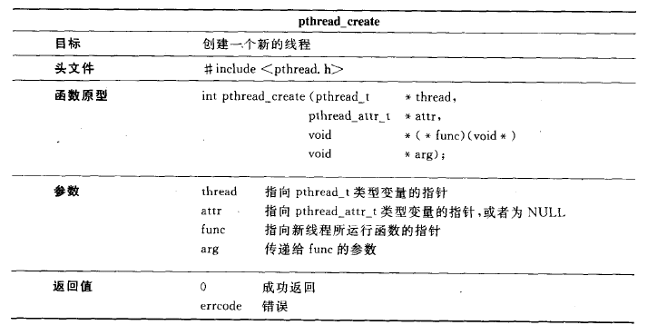
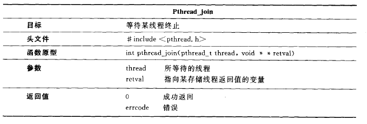

[POSIX介绍](https://blog.csdn.net/weixin_40039738/article/details/81867577)

**线程接口也称为“pthread”或“POSIX 线程”**。

**使用 pthread 需要包含一个头文件：pthread.h**

 **同时连一个共享库：libpthread.so  即 gcc 编译时加选项 -lpthread**

```shell
gcc twoCount3.c -lpthread -o twc
```


## 线程的创建：如何执行一个新子项目？


pthread_create 不是一个系统调用，是 Glibc 库的一个函数







现在完成一个并行记录文件中单词个数多线程应用

对于线程需要多个参数， 可以采用结构体来传送

```c
struct arg_set{
    char *fname;
    int cnt;
};
```

进行线程的创建

```c
    args1.fname = argv[1];
    args1.cnt = 0;
    pthread_create(&t1, NULL, countWords, (void*)&args1);
    
    args2.fname = argv[2];
    args2.cnt = 0;
    pthread_create(&t2, NULL, countWords, (void*)&args2);
```

等待线程完成，并返回参数

```c
    // 进行等待
    pthread_join(t1, NULL);
    pthread_join(t2, NULL);

    printf("%5d: %s\n", args1.cnt, argv[1]);
	printf("%5d: %s\n", args2.cnt, argv[2]);
	printf("%5d: total words\n", args1.cnt + args2.cnt);
```

output

```shell
husharp@hjh-Ubuntu:~/CS/Unix-Linux/Unix&Linux_Programming/ch14$ ./twc ./README.md ./twoCount3.c 
    3: ./README.md
  168: ./twoCount3.c
  171: total words
```

