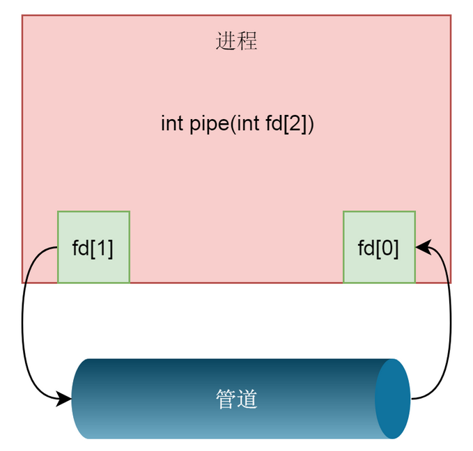
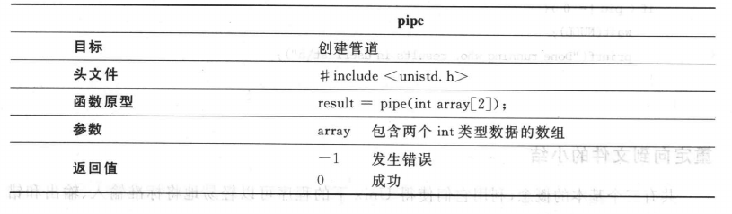
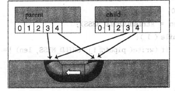
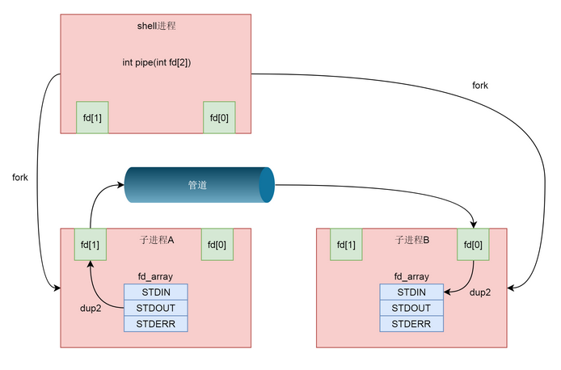
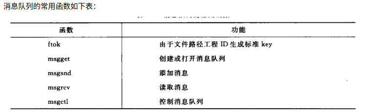
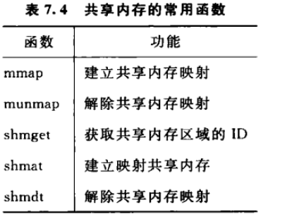

Linux中，在新的一行的开头，按下Ctrl-D，就代表EOF（如果在一行的中间按下Ctrl-D，则表示输出"标准输入"的缓存区，所以这时必须按两次Ctrl-D）；Windows中，Ctrl-Z表示EOF。（顺便提一句，Linux中按下Ctrl-Z，表示将该进程中断，在后台挂起，用fg命令可以重新切回到前台；按下Ctrl-C表示终止该进程。）

那么，如果真的想输入Ctrl-D怎么办？这时必须先按下Ctrl-V，然后就可以输入Ctrl-D，系统就不会认为这是EOF信号。[Ctrl-V](http://en.wikipedia.org/wiki/Ctrl-V)表示按"字面含义"解读下一个输入，要是想按"字面含义"输入Ctrl-V，连续输入两次就行了。


[select、poll、epoll之间的区别总结](https://www.cnblogs.com/Anker/p/3265058.html)


[System V 与 POSIX](https://blog.csdn.net/firstlai/article/details/50705042)

# 进程间通信

[进程间通信方式](https://www.cnblogs.com/LUO77/p/5816326.html)

## 常见的通信方式：

1. 管道pipe：管道是一种半双工的通信方式，数据只能单向流动，而且只能在具有亲缘关系的进程间使用。进程的亲缘关系通常是指父子进程关系。
2. 命名管道FIFO：有名管道也是半双工的通信方式，但是它允许无亲缘关系进程间的通信。、
3. 消息队列MessageQueue：消息队列是由消息的链表，存放在内核中并由消息队列标识符标识。消息队列克服了信号传递信息少、管道只能承载无格式字节流以及缓冲区大小受限等缺点。
4. 共享存储SharedMemory：共享内存就是映射一段能被其他进程所访问的内存，这段共享内存由一个进程创建，但多个进程都可以访问。共享内存是最快的 IPC 方式，它是针对其他进程间通信方式运行效率低而专门设计的。它往往与其他通信机制，如信号两，配合使用，来实现进程间的同步和通信。
5. 信号量Semaphore：信号量是一个计数器，可以用来控制多个进程对共享资源的访问。它常作为一种锁机制，防止某进程正在访问共享资源时，其他进程也访问该资源。因此，主要作为进程间以及同一进程内不同线程之间的同步手段。
6. 套接字Socket：套解口也是一种进程间通信机制，与其他通信机制不同的是，它可用于不同及其间的进程通信。
7. 信号 ( sinal ) ： 信号是一种比较复杂的通信方式，用于通知接收进程某个事件已经发生。


## 管道模型


管道分为两种类型：匿名管道、命名管道

“|” 表示的管道称为**匿名管道**，意思就是这个类型的管道没有名字，用完了就销毁了。就像上面那个命令里面的一样，竖线代表的管道随着命令的执行自动创建、自动销毁。用户甚至都不知道自己在用管道这种技术，就已经解决了问题。所以这也是面试题里面经常会问的，到时候千万别说这是竖线，而要回答背后的机制，管道。

另外一种类型是**命名管道**。这个类型的管道需要通过 mkfifo 命令显式地创建。

```shell
mkfifo hello
```

hello 就是这个管道的名称。管道以文件的形式存在，这也符合 Linux 里面一切皆文件的原则。这个时候，我们 ls 一下，可以看到，这个文件的类型是 p，就是 pipe 的意思。

```
prw-r--r-- 1 husharp husharp   0 12月  1 18:07 hello
```

我们可以往管道里面写入东西。


### 匿名管道




利用下面的系统调用来创建管道



array[0] 是读， array[1] 是写

**所谓的匿名管道，其实就是内核里面的一串缓存**。如果对于 fd[1] 写入，调用的是 pipe_write，向 pipe_buffer 里面写入数据；如果对于 fd[0] 的读入，调用的是 pipe_read，也就是从 pipe_buffer 里面读取数据。

演示打开管道

```c
    // get a pipe
    if(pipe(apipe) == -1) {
        perror("could not make pipe");
		exit(1);
    }
    printf("Got a pipe! It is file descriptors: { %d %d }\n", 
							apipe[0], apipe[1]);
```

进行 `ead from stdin, write into pipe, read from pipe, print `

即内部自己通信演示 demo

```c
    /* read from stdin, write into pipe, read from pipe, print */
    while(fgets(buf, BUFSIZ, stdin)) {
        len = strlen(buf);
        if(write(apipe[1], buf, len) != len) {
            perror("writing to pipe");		/* down */
			break;					/* pipe */
        }
        for ( i = 0; i < len; i++)  // wipe
        {
            buf[i] = 'X';
        }
        // printf("%s ", *buf);
        len = read(apipe[0], buf, BUFSIZ);
		if ( len == -1 ){				/* from */
			perror("reading from pipe");		/* pipe */
			break;
		}
		if ( write( 1 , buf, len ) != len ){		/* send  */
			perror("writing to stdout");		/* to    */
			break;					/* stdout */
		}
    }
```

#### 采用 fork 来共享管道

但是这个时候，两个文件描述符都是在一个进程里面的，并没有起到进程间通信的作用，怎么样才能使得管道是跨两个进程的呢？还记得创建进程调用的 fork 吗？

创建的子进程会复制父进程的 struct files_struct，两个进程就可以通过各自的 fd 写入和读取同一个管道文件实现跨进程通信了。



因为父进程和子进程都可以写入，也都可以读出，通常的方法是父进程关闭读取的 fd，只保留写入的 fd，而子进程关闭写入的 fd，只保留读取的 fd，如果需要双向通行，则应该创建两个管道。

```c
	if ( pipe( pipefd ) == -1 )
		oops("cannot get a pipe", 1);

    int pid = fork();
    if(pid == -1) {
        perror("fork error!");
    } else if(pid == 0) {// child
        close(pipefd[0]);// 关闭读
        char msg[] = "hello world";
        write(pipefd[1], msg, strlen(msg) + 1);
        close(pipefd[1]);
        exit(0);
    } else {// parent
        close(pipefd[1]);// 关闭写
        char msg[128];
        read(pipefd[0], msg, 128);
        close(pipefd[0]);
        printf("message: %s\n", msg);
        return 0;
    }
}
```

#### 建立不同进程间的管道通信

我们仅仅解析了使用管道进行父子进程之间的通信，但是我们在 shell 里面的不是这样的。在 shell 里面运行 A|B 的时候，A 进程和 B 进程都是 shell 创建出来的子进程，A 和 B 之间不存在父子关系。

那么怎么建立不同进程间的 匿名管道通信呢？

我们首先从 shell 创建子进程 A，然后在 shell 和 A 之间建立一个管道，其中 shell 保留读取端，A 进程保留写入端，然后  shell 再创建子进程 B。这又是一次 fork，所以，shell 里面保留的读取端的 fd 也被复制到了子进程 B 里面。这个时候，相当于  shell 和 B 都保留读取端，只要 shell 主动关闭读取端，就变成了一管道，写入端在 A 进程，读取端在 B 进程。

接下来我们要做的事情就是，将这个管道的两端和输入输出关联起来。这就要用到 dup2 系统调用了。

```c
int dup2(int oldfd, int newfd);
```

这个系统调用，将老的文件描述符赋值给新的文件描述符，让 newfd 的值和 oldfd 一样。



在 A 进程中，写入端可以做这样的操作：dup2(fd[1],STDOUT_FILENO)，将 STDOUT_FILENO（也即第一项）不再指向标准输出，而是指向创建的管道文件，那么以后往标准输出写入的任何东西，都会写入管道文件。

在 B 进程中，读取端可以做这样的操作，dup2(fd[0],STDIN_FILENO)，将 STDIN_FILENO 也即第零项不再指向标准输入，而是指向创建的管道文件，那么以后从标准输入读取的任何东西，都来自于管道文件。

```c
	if ( pipe( pipefd ) == -1 )
		oops("cannot get a pipe", 1);

    int pid = fork();
    if(pid == -1) {
        perror("fork error!");
    } else if(pid == 0) {// child
    // 不再指向标准输出，而是指向创建的管道文件，
    // 那么以后往标准输出写入的任何东西，都会写入管道文件。
        dup2(pipefd[1], STDOUT_FILENO);
        close(pipefd[0]);
        close(pipefd[1]);
        execlp("ps", "ps", "-ef", NULL);
        exit(0);
    } else {// parent
        dup2(pipefd[0], STDIN_FILENO);
        close(pipefd[0]);
        close(pipefd[1]);
        execlp("grep", "grep", "systemd", NULL);
    }
```


### 命名管道

创建：mkfifo()  使用指定的权限模式来创建 FIFO 

删除：unlink(fifoname) 用来删除 FIFO

监听：open(filename, 属性) 。open 阻塞进程直到某个进程打开 FIFO 进行读取

通信：发送进程采用 write 调用，监听进程使用 read 调用，写进程调用 close 来通知度进程结束。

在linux系统中，除了用pipe系统调用建立管道外，还可以使用C函数库中管道函数popen函数来建立管道，使用pclose关闭管道。

popen的函数原型：

```
FILE* popen(const char* command,const char* type);
```

 

参数说明：command是子进程要执行的命令，type表示管道的类型，r表示读管道，w代表写管道。如果成功返回管道文件的指针，否则返回NULL。

使用popen函数读写管道，实际上也是调用pipe函数调用建立一个管道，再调用fork函数建立子进程，接着会建立一个shell 环境，并在这个shell环境中执行参数所指定的进程。


## 消息队列

消息队列，就是一个消息的链表，是一系列保存在内核中消息的列表。用户进程可以向消息队列添加消息，也可以向消息队列读取消息。

消息队列与管道通信相比，其优势是对每个消息指定特定的消息类型，接收的时候不需要按照队列次序，而是可以根据自定义条件接收特定类型的消息。

可以把消息看做一个记录，具有特定的格式以及特定的优先级。对消息队列有写权限的进程可以向消息队列中按照一定的规则添加新消息，对消息队列有读权限的进程可以从消息队列中读取消息。



进程间通过消息队列通信，主要是：创建或打开消息队列，添加消息，读取消息和控制消息队列。

创建一个消息队列，使用**msgget 函数**。这个函数需要有一个参数 key，这是消息队列的唯一标识，应该是唯一的。如何保持唯一性呢？这个还是和文件关联。

我们可以指定一个文件，ftok 会根据这个文件的 inode，生成一个近乎唯一的 key。只要在这个消息队列的生命周期内，这个文件不要被删除就可以了。只要不删除，无论什么时刻，再调用 ftok，也会得到同样的 key。

`$ touch message`

```shell
Message Queue key: 399205.
Message queue id: 0.
```

此时查看

```
$ ipcs -q

--------- 消息队列 -----------
键        msqid      拥有者  权限     已用字节数 消息      
0x00061765 0          husharp    777        0            0    
```

通过指定发送消息的结构体，对每个消息指定特定的消息类型，接收的时候不需要按照队列次序，而是可以根据自定义条件接收特定类型的消息。

例：用函数msget创建消息队列，调用msgsnd函数，把输入的字符串添加到消息队列中，然后调用msgrcv函数，读取消息队列中的消息并打印输出，最后再调用msgctl函数，删除系统内核中的消息队列。


## 共享内存

共享内存段对应进程，就像共享变量对于线程一样。

共享内存允许两个或多个进程共享一个给定的存储区，这一段存储区可以被两个或两个以上的进程映射至自身的地址空间中，一个进程写入共享内存的信息，可以被其他使用这个共享内存的进程，通过一个简单的内存读取错做读出，从而实现了进程间的通信。

拿出一块虚拟地址空间来，映射到相同的物理内存中。这样这个进程写入的东西，另外一个进程马上就能看到了，都不需要拷贝来拷贝去，传来传去。




## 信号量 和 互斥

### 区别

互斥只能一个：

一个防止他人进入的简单方法，就是门口加一把锁。先到的人锁上门，后到的人看到上锁，就在门口排队，等锁打开再进去。这就叫["互斥锁"](http://zh.wikipedia.org/wiki/互斥锁)（Mutual exclusion，缩写 Mutex），防止多个线程同时读写某一块内存区域。

信号量可以多个：

就是在门口挂n把钥匙。进去的人就取一把钥匙，出来时再把钥匙挂回原处。后到的人发现钥匙架空了，就知道必须在门口排队等着了。这种做法叫做["信号量"](http://en.wikipedia.org/wiki/Semaphore_(programming))（Semaphore），用来保证多个线程不会互相冲突。

mutex是semaphore的一种特殊情况（n=1时）。也就是说，完全可以用后者替代前者。但是，因为mutex较为简单，且效率高，所以在必须保证资源独占的情况下，还是采用这种设计。


