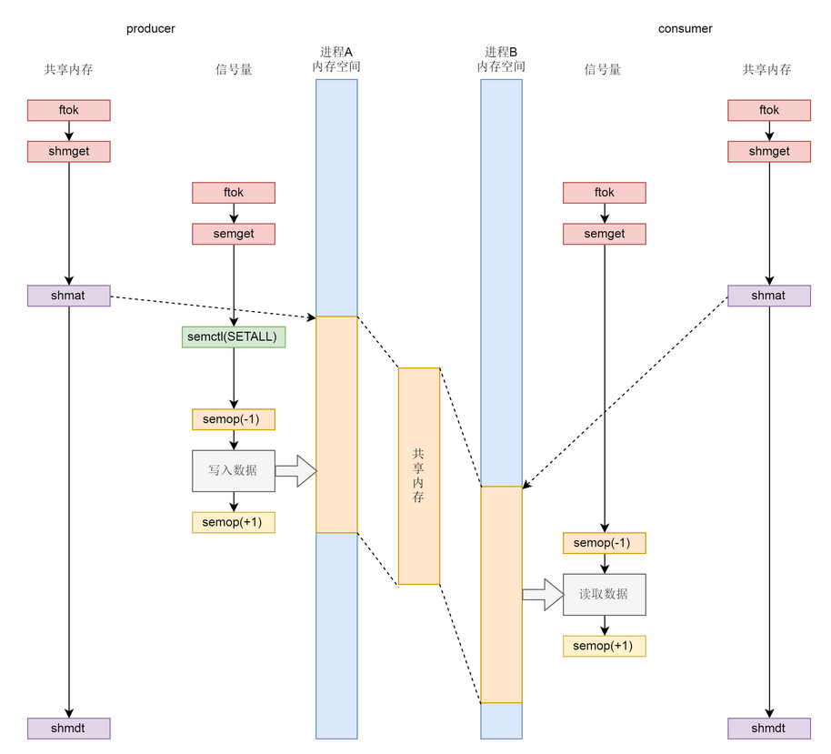
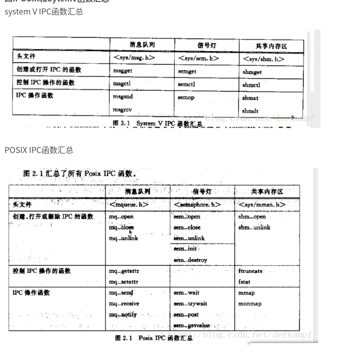

# 进程间通信

[进程间通信方式](https://www.cnblogs.com/LUO77/p/5816326.html)


Linux中，在新的一行的开头，按下Ctrl-D，就代表EOF（如果在一行的中间按下Ctrl-D，则表示输出"标准输入"的缓存区，所以这时必须按两次Ctrl-D）；Windows中，Ctrl-Z表示EOF。（顺便提一句，Linux中按下Ctrl-Z，表示将该进程中断，在后台挂起，用fg命令可以重新切回到前台；按下Ctrl-C表示终止该进程。）

那么，如果真的想输入Ctrl-D怎么办？这时必须先按下Ctrl-V，然后就可以输入Ctrl-D，系统就不会认为这是EOF信号。[Ctrl-V](http://en.wikipedia.org/wiki/Ctrl-V)表示按"字面含义"解读下一个输入，要是想按"字面含义"输入Ctrl-V，连续输入两次就行了。


[select、poll、epoll之间的区别总结](https://www.cnblogs.com/Anker/p/3265058.html)

见此 Blog


[System V 与 POSIX](https://blog.csdn.net/firstlai/article/details/50705042)

# 常见的通信方式：

进程间通信主要包括管道、系统IPC（包括消息队列、信号量、信号、共享内存等）、以及套接字socket。 

1. 管道pipe：管道是一种半双工的通信方式，数据只能单向流动，而且只能在具有亲缘关系的进程间使用。进程的亲缘关系通常是指父子进程关系。
2. 命名管道 FIFO：命名管道也是半双工的通信方式，但是它允许无亲缘关系进程间的通信。
3. 消息队列 MessageQueue：消息队列是由消息的链表，存放在内核中并由消息队列标识符标识。消息队列克服了信号传递信息少、管道只能承载无格式字节流以及缓冲区大小受限等缺点。
4. 共享内存 SharedMemory：共享内存就是映射一段能被其他进程所访问的内存，这段共享内存由一个进程创建，但多个进程都可以访问。**共享内存是最快的 IPC 方式**，它是针对其他进程间通信方式运行效率低而专门设计的。它往往与其他通信机制，如信号量，配合使用，来实现进程间的同步和通信。
5. 信号量 Semaphore ：信号量是一个计数器，可以用来控制多个进程对共享资源的访问。它常作为一种锁机制，防止某进程正在访问共享资源时，其他进程也访问该资源。因此，主要作为进程间以及同一进程内不同线程之间的同步手段。
6. 套接字 Socket ：套接字也是一种进程间通信机制，与其他通信机制不同的是，它可用于不同机器间的进程通信。
7. 信号 ( sinal ) ： 信号是一种比较复杂的通信方式，用于通知接收进程某个事件已经发生。

还可以通过文件来进行进程间通信


## 管道模型


管道分为两种类型：匿名管道、命名管道

“|” 表示的管道称为**匿名管道**，意思就是这个类型的管道没有名字，用完了就销毁了。就像上面那个命令里面的一样，竖线代表的管道随着命令的执行自动创建、自动销毁。用户甚至都不知道自己在用管道这种技术，就已经解决了问题。所以这也是面试题里面经常会问的，到时候千万别说这是竖线，而要回答背后的机制，管道。

另外一种类型是**命名管道**。这个类型的管道需要通过 mkfifo 命令显式地创建。

```shell
mkfifo hello
```

hello 就是这个管道的名称。管道以文件的形式存在，这也符合 Linux 里面一切皆文件的原则。这个时候，我们 ls 一下，可以看到，这个文件的类型是 p，就是 pipe 的意思。

```
prw-r--r-- 1 husharp husharp   0 12月  1 18:07 hello
```

我们可以往管道里面写入东西。


### 匿名管道


利用下面的系统调用来创建管道


array[0] 是读， array[1] 是写

**所谓的匿名管道，其实就是内核里面的一串缓存**。如果对于 fd[1] 写入，调用的是 pipe_write，向 pipe_buffer 里面写入数据；如果对于 fd[0] 的读入，调用的是 pipe_read，也就是从 pipe_buffer 里面读取数据。

演示打开管道

```c
    // get a pipe
    if(pipe(apipe) == -1) {
        perror("could not make pipe");
		exit(1);
    }
    printf("Got a pipe! It is file descriptors: { %d %d }\n", 
							apipe[0], apipe[1]);
```

进行 `ead from stdin, write into pipe, read from pipe, print `

即内部自己通信演示 demo

```c
    /* read from stdin, write into pipe, read from pipe, print */
    while(fgets(buf, BUFSIZ, stdin)) {
        len = strlen(buf);
        if(write(apipe[1], buf, len) != len) {
            perror("writing to pipe");		/* down */
			break;					/* pipe */
        }
        for ( i = 0; i < len; i++)  // wipe
        {
            buf[i] = 'X';
        }
        // printf("%s ", *buf);
        len = read(apipe[0], buf, BUFSIZ);
		if ( len == -1 ){				/* from */
			perror("reading from pipe");		/* pipe */
			break;
		}
		if ( write( 1 , buf, len ) != len ){		/* send  */
			perror("writing to stdout");		/* to    */
			break;					/* stdout */
		}
    }
```

#### 采用 fork 来共享管道

但是这个时候，两个文件描述符都是在一个进程里面的，并没有起到进程间通信的作用，怎么样才能使得管道是跨两个进程的呢？还记得创建进程调用的 fork 吗？

创建的子进程会复制父进程的 struct files_struct，两个进程就可以通过各自的 fd 写入和读取同一个管道文件实现跨进程通信了。


因为父进程和子进程都可以写入，也都可以读出，通常的方法是父进程关闭读取的 fd，只保留写入的 fd，而子进程关闭写入的 fd，只保留读取的 fd，**如果需要双向通行，则应该创建两个管道。**

```c
	if ( pipe( pipefd ) == -1 )
		oops("cannot get a pipe", 1);

    int pid = fork();
    if(pid == -1) {
        perror("fork error!");
    } else if(pid == 0) {// child
        close(pipefd[0]);// 关闭读
        char msg[] = "hello world";
        write(pipefd[1], msg, strlen(msg) + 1);
        close(pipefd[1]);
        exit(0);
    } else {// parent
        close(pipefd[1]);// 关闭写
        char msg[128];
        read(pipefd[0], msg, 128);
        close(pipefd[0]);
        printf("message: %s\n", msg);
        return 0;
    }
}
```

#### 建立不同进程间的管道通信

我们仅仅解析了使用管道进行父子进程之间的通信，但是我们在 shell 里面的不是这样的。在 shell 里面运行 A|B 的时候，A 进程和 B 进程都是 shell 创建出来的子进程，A 和 B 之间不存在父子关系。

那么怎么建立不同进程间的 匿名管道通信呢？

我们首先从 shell 创建子进程 A，然后在 shell 和 A 之间建立一个管道，其中 shell 保留读取端，A 进程保留写入端，然后  shell 再创建子进程 B。这又是一次 fork，所以，shell 里面保留的读取端的 fd 也被复制到了子进程 B 里面。这个时候，相当于  shell 和 B 都保留读取端，只要 shell 主动关闭读取端，就变成了一管道，写入端在 A 进程，读取端在 B 进程。

接下来我们要做的事情就是，将这个管道的两端和输入输出关联起来。这就要用到 dup2 系统调用了。

```c
int dup2(int oldfd, int newfd);
```

这个系统调用，将老的文件描述符赋值给新的文件描述符，让 newfd 的值和 oldfd 一样。


在 A 进程中，写入端可以做这样的操作：dup2(fd[1],STDOUT_FILENO)，将 STDOUT_FILENO（也即第一项）不再指向标准输出，而是指向创建的管道文件，那么以后往标准输出写入的任何东西，都会写入管道文件。

在 B 进程中，读取端可以做这样的操作，dup2(fd[0],STDIN_FILENO)，将 STDIN_FILENO 也即第零项不再指向标准输入，而是指向创建的管道文件，那么以后从标准输入读取的任何东西，都来自于管道文件。

```c
	if ( pipe( pipefd ) == -1 )
		oops("cannot get a pipe", 1);

    int pid = fork();
    if(pid == -1) {
        perror("fork error!");
    } else if(pid == 0) {// child
    // 不再指向标准输出，而是指向创建的管道文件，
    // 那么以后往标准输出写入的任何东西，都会写入管道文件。
        dup2(pipefd[1], STDOUT_FILENO);
        close(pipefd[0]);
        close(pipefd[1]);
        execlp("ps", "ps", "-ef", NULL);
        exit(0);
    } else {// parent
        dup2(pipefd[0], STDIN_FILENO);
        close(pipefd[0]);
        close(pipefd[1]);
        execlp("grep", "grep", "systemd", NULL);
    }
```


### 命名管道

创建：mkfifo()  使用指定的权限模式来创建 FIFO 

删除：unlink(fifoname) 用来删除 FIFO

监听：open(filename, 属性) 。open 阻塞进程直到某个进程打开 FIFO 进行读取

通信：发送进程采用 write 调用，监听进程使用 read 调用，进程调用 close 来通知进程结束。

在 linux 系统中，除了用 pipe系统调用建立管道外，还可以使用 C 函数库中管道函数 popen 函数来建立管道，使用 pclose 关闭管道。

popen的函数原型：

```
FILE* popen(const char* command,const char* type);
```

 **所谓的命名管道，其实是也是内核里面的一串缓存。**

参数说明：command 是子进程要执行的命令，type表示管道的类型，r表示读管道，w代表写管道。如果成功返回管道文件的指针，否则返回NULL。

使用 popen 函数读写管道，实际上也是调用pipe函数调用建立一个管道，再调用fork函数建立子进程，接着会建立一个shell 环境，并在这个shell环境中执行参数所指定的进程。


# 系统 IPC

系统 IPC 的 API 非常相似。这三种进程间通信机制包括：ftok 会根据这个文件的 inode，生成一个近乎唯一的 key、行为创建 xxxget、使用、控制 xxxctl。

## 消息队列

消息队列，就是一个消息的链表，是一系列保存在内核中消息的列表。用户进程可以向消息队列添加消息，也可以向消息队列读取消息。

消息队列与管道通信相比，其优势是对每个消息指定特定的消息类型，接收的时候不需要按照队列次序，而是可以根据自定义条件接收特定类型的消息。

可以把消息看做一个记录，具有特定的格式以及特定的优先级。对消息队列有写权限的进程可以向消息队列中按照一定的规则添加新消息，对消息队列有读权限的进程可以从消息队列中读取消息。


进程间通过消息队列通信，主要是：创建或打开消息队列，添加消息，读取消息和控制消息队列。

创建一个消息队列，使用**msgget 函数**。这个函数需要有一个参数 key，这是消息队列的唯一标识，应该是唯一的。如何保持唯一性呢？这个还是和文件关联。

我们可以指定一个文件，ftok 会根据这个文件的 inode，生成一个近乎唯一的 key。只要在这个消息队列的生命周期内，这个文件不要被删除就可以了。只要不删除，无论什么时刻，再调用 ftok，也会得到同样的 key。

`$ touch message`

```shell
Message Queue key: 399205.
Message queue id: 0.
```

> System V IPC 体系有一个统一的命令行工具：ipcmk，ipcs 和 ipcrm 用于创建、查看和删除 IPC 对象。

此时查看

```
$ ipcs -q

--------- 消息队列 -----------
键        msqid      拥有者  权限     已用字节数 消息      
0x00061765 0          husharp    777        0            0    
```

通过指定发送消息的结构体，对每个消息指定特定的消息类型，接收的时候不需要按照队列次序，而是可以根据自定义条件接收特定类型的消息。

例：用函数 msget 创建消息队列，调用 msgsnd 函数，把输入的字符串添加到消息队列中，然后调用 msgrcv 函数，读取消息队列中的消息并打印输出，最后再调用 msgctl 函数，删除系统内核中的消息队列。

有了消息这种模型，两个进程之间的通信就像咱们平时发邮件一样，你来一封，我回一封，可以频繁沟通了。


## 共享内存

共享内存段对应进程，就像共享变量对于线程一样。

共享内存允许两个或多个进程共享一个给定的存储区，这一段存储区可以被两个或两个以上的进程映射至自身的地址空间中，一个进程写入共享内存的信息，可以被其他使用这个共享内存的进程，通过一个简单的内存读取错做读出，从而实现了进程间的通信。

拿出一块虚拟地址空间来，映射到相同的物理内存中。这样这个进程写入的东西，另外一个进程马上就能看到了，都不需要拷贝来拷贝去，传来传去。


创建之前，我们要有一个 key 来唯一标识这个共享内存。这个 key 可以根据文件系统上的一个文件的 inode 随机生成。

然后，我们需要创建一个共享内存，就像创建一个消息队列差不多，都是使用 xxxget 来创建。其中，创建共享内存使用的是下面这个函数：

```c
int shmget(key_t key, size_t size, int shmflag);
```

key 就是前面生成的那个 key，shmflag 如果为 IPC_CREAT，就表示新创建，还可以指定读写权限 0777。

对于共享内存，需要指定一个大小 size，这个一般要申请多大呢？一个最佳实践是，我们将多个进程需要共享的数据放在一个 struct  里面，然后这里的 size 就应该是这个 struct 的大小。这样每一个进程得到这块内存后，只要强制将类型转换为这个 struct  类型，就能够访问里面的共享数据了。

生成了共享内存以后，接下来就是将这个共享内存映射到进程的虚拟地址空间中。我们使用下面这个函数来进行操作。

```c
void *shmat(int  shm_id, const  void *addr, int shmflg);
```

这里面的 shm_id，就是上面创建的共享内存的 id，addr 就是指定映射在某个地方。如果不指定，则内核会自动选择一个地址，作为返回值返回。

当共享内存使用完毕，我们可以通过 shmdt 解除它到虚拟内存的映射。

```c
int shmdt(const  void *shmaddr)；
```


## 信号量

[Linux的信号量集](https://yngzmiao.blog.csdn.net/article/details/81674118?utm_medium=distribute.pc_relevant.none-task-blog-BlogCommendFromMachineLearnPai2-3.control&depth_1-utm_source=distribute.pc_relevant.none-task-blog-BlogCommendFromMachineLearnPai2-3.control)

信号量以集合的形式存在的

接下来生产者和消费者要通过 semop(-1) 来竞争信号量，如果生产者抢到信号量则写入，然后通过 semop(+1) 释放信号量，如果消费者抢到信号量则读出，然后通过 semop(+1) 释放信号量；

1.创建之前，我们同样需要有一个 key，来唯一标识这个信号量集合。这个 key 同样可以根据文件系统上的一个文件的 inode 随机生成。

```C
eg:
key = ftok("/root/sharememory/semaphorekey", 1024)
```

然后，我们需要创建一个信号量集合，同样也是使用 xxxget 来创建，其中创建信号量集合使用的是下面这个函数。

```c
int semget(key_t key, int nsems, int semflg);
```

- key，就是前面生成的那个 key，shmflag 如果为 IPC_CREAT，就表示新创建，还可以指定读写权限 0777。
- nsems 表示这个信号量集合里面有几个信号量（信号量往往代表某种资源的数量，如果用信号量做互斥，那往往将信号量设置为 1。）
- 如果只是打开信号量，把 nsems 设置为0即可。该参数只在创建信号量集时有效。
- 使用信号量集可以同时把多个共享资源设置为互斥资源。

对于信号量，往往要定义两种操作，P 操作和 V 操作。对应上面代码中 semaphore_p 函数和 semaphore_v  函数

- semaphore_p 会调用 semop  函数将信号量的值减一，表示申请占用一个资源，当发现当前没有资源的时候，进入等待。
- semaphore_v 会调用 semop  函数将信号量的值加一，表示释放一个资源，释放之后，就允许等待中的其他进程占用这个资源。
- 可以用这个信号量，来保护共享内存中的 struct shm_data，使得同时只有一个进程可以操作这个结构。

```c
int semaphore_p (int semid) {
  struct sembuf operations[1]; 
  operations[0].sem_num = 0; 
  operations[0].sem_op = -1; 
  operations[0].sem_flg = SEM_UNDO; 
  return semop (semid, operations, 1); 
}

int semaphore_v (int semid) {
  struct sembuf operations[1]; 
  operations[0].sem_num = 0; 
  operations[0].sem_op = 1; 
  operations[0].sem_flg = SEM_UNDO; 
  return semop (semid, operations, 1); 
} 
```


### 共享内存和信号量的配合机制

- 无论是共享内存还是信号量，创建与初始化都遵循同样流程，通过 ftok 得到 key，通过 xxxget 创建对象并生成 id；
- 生产者和消费者都通过 shmat 将共享内存映射到各自的内存空间，在不同的进程里面映射的位置不同；
- 为了访问共享内存，需要信号量进行保护，信号量需要通过 semctl 初始化为某个值；
- 接下来生产者和消费者要通过 semop(-1) 来竞争信号量，如果生产者抢到信号量则写入，然后通过 semop(+1) 释放信号量，如果消费者抢到信号量则读出，然后通过 semop(+1) 释放信号量；
- 共享内存使用完毕，可以通过 shmdt 来解除映射。




### SEM_UNDO

其实还有一点需要强调一下，信号量是一个整个 Linux  可见的全局资源，而不像咱们在线程同步那一节讲过的都是某个进程独占的资源，好处是可以跨进程通信，坏处就是如果一个进程通过 P  操作拿到了一个信号量，但是不幸异常退出了，如果没有来得及归还这个信号量，可能所有其他的进程都阻塞了。

那怎么办呢？Linux 有一种机制叫 SEM_UNDO，也即每一个 semop 操作都会保存一个反向 struct sem_undo 操作，当因为某个进程异常退出的时候，这个进程做的所有的操作都会回退，从而保证其他进程可以正常工作。

无论哪个进程异常退出，只要将 undo 结构里面的值加回当前信号量的值，就能够得到正确的信号量的值，不会因为一个进程退出，导致信号量的值处于不一致的状态。

> System V sem 则不同，无论有无竞争都要执行系统调用，因此性能落了下风。
>  POSIX sem 由于没有事事烦扰内核，
> 所以内核也无法帮他记录 sem_adj ，即POSIX sem 并没有UNDO(回滚)功能。
>
> 


## 

## 请你说一说死锁发生的条件以及如何解决死锁 

**参考回答：**

 死锁是指两个或两个以上进程在执行过程中，因争夺资源而造成的相互等待的现象。死锁发生的四个必要条件如下： 

- 互斥：进程对所分配到的资源不允许其他进程访问，若其他进程访问该资源，只能等待，直至占有该资源的进程使用完成后释放该资源； 

- 持有并等待：进程获得一定的资源后，又对其他资源发出请求，但是该资源可能被其他进程占有，此时请求阻塞，但该进程不会释放自己已经占有的资源 
- 非抢占：进程已获得的资源，在未完成使用之前，不可被剥夺，只能在使用后自己释放 
- 循环等待：进程发生死锁后，必然存在一个进程-资源之间的环形链 

  解决死锁的方法即破坏上述四个条件之一，主要方法如下： 

类似消防

- 死锁预防：确保系统永远不会进入死锁			——禁止用火
- 死锁避免：使用前进行判断，只允许不会进入死锁的进程请求资源      ——只允许消防员用火
- 死锁检测和恢复：对进入死锁的进行恢复         —— 灭火

# 线程间通信

线程间通信的方式: 

- 临界区：通过多线程的串行化来访问公共资源或一段代码，速度快，适合控制数据访问； 
- 互斥量 Synchronized/Lock：采用互斥对象机制，只有拥有互斥对象的线程才有访问公共资源的权限。因为互斥对象只有一个，所以可以保证公共资源不会被多个线程同时访问 
- 信号量 Semphare：为控制具有有限数量的用户资源而设计的，它允许多个线程在同一时刻去访问同一个资源，但一般需要限制同一时刻访问此资源的最大线程数目。 
- 事件(信号)，Wait/Notify：通过通知操作的方式来保持多线程同步，还可以方便的实现多线程优先级的比较操作 


## 请你说一说线程间的同步方式，具体的系统调用 

- 信号量 

  信号量是一种特殊的变量，可用于线程同步。它只取自然数值，并且只支持两种操作： 

  P(SV):如果信号量SV大于0，将它减一；如果SV值为0，则挂起该线程。 

  V(SV)：如果有其他进程因为等待SV而挂起，则唤醒，然后将SV+1；否则直接将SV+1。 

  其系统调用为： 

```
  sem_wait（sem_t *sem）：以原子操作的方式将信号量减1，如果信号量值为0，则sem_wait将被阻塞，直到这个信号量具有非0值。 

  sem_post（sem_t *sem)：以原子操作将信号量值+1。当信号量大于0时，其他正在调用sem_wait等待信号量的线程将被唤醒。 

```

  
 

- 互斥量 

  互斥量又称互斥锁，主要用于线程互斥，不能保证按序访问，可以和条件锁一起实现同步。当进入临界区    时，需要获得互斥锁并且加锁；当离开临界区时，需要对互斥锁解锁，以唤醒其他等待该互斥锁的线程。其主要的系统调用如下： 

```
  pthread_mutex_init:初始化互斥锁 

  pthread_mutex_destroy：销毁互斥锁 

  pthread_mutex_lock：以原子操作的方式给一个互斥锁加锁，如果目标互斥锁已经被上锁，pthread_mutex_lock调用将阻塞，直到该互斥锁的占有者将其解锁。 

  pthread_mutex_unlock:以一个原子操作的方式给一个互斥锁解锁。 
```

  
 

- 条件变量 

   条件变量，又称条件锁，用于在线程之间同步共享数据的值。条件变量提供一种线程间通信机制：当某个共享数据达到某个值时，唤醒等待这个共享数据的一个/多个线程。即，当某个共享变量等于某个值时，调用 signal/broadcast。此时操作共享变量时需要加锁。其主要的系统调用如下： 

```
  pthread_cond_init:初始化条件变量 

  pthread_cond_destroy：销毁条件变量 

  pthread_cond_signal：唤醒一个等待目标条件变量的线程。哪个线程被唤醒取决于调度策略和优先级。 

  pthread_cond_wait：等待目标条件变量。需要一个加锁的互斥锁确保操作的原子性。该函数中在进入wait状态前首先进行解锁，然后接收到信号后会再加锁，保证该线程对共享资源正确访问。 
```

 条件变量机制是将全局标记、线程信号、线程休眠、加锁解锁结合在了一起。主要内容包含在pthread_cond_wait函数内，包括：

 1 检测条件变量，为真从函数返回，继续执行下一步，为假，则：

 1.1 设置线程等待条件（变量变为真的）信号

 1.2 让线程进入休眠状态

 1.3 释放互斥锁

 2 收到条件（变量变为真的）信号后，则：

 2.1 唤醒休眠的线程

 2.2 重新获取互斥锁

 2.3 重新检测条件变量，为假，则继续执行步骤1，为真则从函数内返回。

 pthread_cond_signal函数的主要工作是负责修改条件变量的值和发送信号提醒等待线程条件变量变成了真值。


## 信号量 和 互斥 区别

互斥只能一个：

一个防止他人进入的简单方法，就是门口加一把锁。先到的人锁上门，后到的人看到上锁，就在门口排队，等锁打开再进去。这就叫["互斥锁"](http://zh.wikipedia.org/wiki/互斥锁)（Mutual exclusion，缩写 Mutex），防止多个线程同时读写某一块内存区域。

信号量可以多个：

就是在门口挂n把钥匙。进去的人就取一把钥匙，出来时再把钥匙挂回原处。后到的人发现钥匙架空了，就知道必须在门口排队等着了。这种做法叫做["信号量"](http://en.wikipedia.org/wiki/Semaphore_(programming))（Semaphore），用来保证多个线程不会互相冲突。

mutex是semaphore的一种特殊情况（n=1时）。也就是说，完全可以用后者替代前者。但是，因为mutex较为简单，且效率高，所以在必须保证资源独占的情况下，还是采用这种设计。


## 信号量和条件变量的区别和联系

（1）使用条件变量可以一次唤醒所有等待者，而这个信号量没有的功能，感觉是最大区别。

（2）信号量是有一个值（状态的），而条件变量是没有的，没有地方记录唤醒（发送信号）过多少次，也没有地方记录唤醒线程（wait返回）过多少次。从实现上来说一个信号量可以是用mutex + counter + condition  variable实现的。因为信号量有一个状态，如果想精准的同步，那么信号量可能会有特殊的地方。信号量可以解决条件变量中存在的唤醒丢失问题。

（3）在Posix.1基本原理一文声称，有了互斥锁和条件变量还提供信号量的原因是：“本标准提供信号量的而主要目的是提供一种进程间同步的方式；这些进程可能共享也可能不共享内存区。互斥锁和条件变量是作为线程间的同步机制说明的；这些线程总是共享(某个)内存区。这两者都是已广泛使用了多年的同步方式。每组原语都特别适合于特定的问题”。尽管信号量的意图在于进程间同步，互斥锁和条件变量的意图在于线程间同步，但是信号量也可用于线程间，互斥锁和条件变量也可用于进程间。应当根据实际的情况进行决定。信号量最有用的场景是用以指明可用资源的数量。


# Linux的4种锁机制： 

多个线程可同时访问同一块内存。如果不对访问这块内存的临界区进行互斥或者同步，那么进程的运行很可能出现一些不可预知的错误和结果。接下来我们了解三种常见的Linux下的互斥操作—>锁。

- 互斥锁：mutex，用于保证在任何时刻，都只能有一个线程访问该对象。当获取锁操作失败时，线程会进入睡眠，等待锁释放时被唤醒 
- 读写锁：rwlock，分为读锁和写锁。处于读操作时，可以允许多个线程同时获得读操作。但是同一时刻只能有一个线程可以获得写锁。其它获取写锁失败的线程都会进入睡眠状态，直到写锁释放时被唤醒。  
  - 注意：写锁会阻塞其它读写锁。当有一个线程获得写锁在写时，读锁也不能被其它线程获取；写者优先于读者（一旦有写者，则后续读者必须等待，唤醒时优先考虑写者）。
  - 读写锁适合于对数据结构的读次数比写次数多得多的情况.因为,读模式锁定时可以共享,以写 模式锁住时意味着独占,所以读写锁又叫共享-独占锁. 
- 自旋锁：spinlock，在任何时刻同样只能有一个线程访问对象。但是当获取锁操作失败时，不会进入睡眠，而是会在原地自旋，直到锁被释放。这样节省了线程从睡眠状态到被唤醒期间的消耗，在加锁时间短暂的环境下会极大的提高效率。但如果加锁时间过长，则会非常浪费CPU资源。 
- RCU：即read-copy-update，在修改数据时，首先需要读取数据，然后生成一个副本，对副本进行修改。修改完成后，再将老数据update成新的数据。使用RCU时，读者几乎不需要同步开销，既不需要获得锁，也不使用原子指令，不会导致锁竞争，因此就不用考虑死锁问题了。而对于写者的同步开销较大，它需要复制被修改的数据，还必须使用锁机制同步并行其它写者的修改操作。在有大量读操作，少量写操作的情况下效率非常高。 


## 乐观锁和悲观锁：

悲观锁：每次去拿数据的时候都认为别人会修改，所以每次在拿数据的时候都会上锁，这样别人想拿这个数据就会block直到它拿到锁。

乐观锁：每次去拿数据的时候都认为别人不会修改，所以不会上锁，但是在更新的时候会判断一下在此期间别人有没有去更新这个数据，可以使用版本号等机制。乐观锁适用于多读的应用类型，这样可以提高吞吐量。